# Work Management — A ServiceNow Scoped Application

A custom enterprise work-management platform built end-to-end on a ServiceNow PDI: project creation, task delegation, role-based access control, workflow automation, notifications, and dashboards — built as a hands-on CSA/CAD portfolio project.

**Scope:** `x_2182741_work_m_0` &nbsp;|&nbsp; **Platform release:** Zurich &nbsp;|&nbsp; **Source control:** this repo, synced via ServiceNow's native GitHub integration

---

## In plain English

Imagine a simplified version of Trello or Asana, but built entirely on the ServiceNow platform instead of as a standalone app.

- A **manager creates a Project** — say, "Website Redesign."
- The project gets broken into **Tasks** — "Design homepage mockup," "Write copy," "Test on mobile" — each one assigned to a specific person, with a priority and a deadline.
- People are grouped into **Teams**, and everyone has a **role**: an **admin** (full control, like an IT owner), a **project manager** (creates and assigns work), a **team lead** (manages their own team's people and tasks), or a **member** (does the work assigned to them).
- Here's the important part: **a regular team member only ever sees the tasks assigned to them** — not everyone else's work, not the whole company's task list. A team lead can manage their own team's roster, but not another team's. This isn't just a setting someone flipped on — it's enforced by the system itself, and it's been tested to prove it actually works, not just configured and hoped for.
- The system **automatically sends emails**: when a task is assigned to you, when a task is overdue, and when a task gets marked done — nobody has to remember to notify anyone manually.
- There's a **dashboard** — a set of simple charts — showing how many tasks are in each status, how many projects are active, and what priority everything is, at a glance.
- Finally, all of this is wrapped in an actual clean, usable screen (called a "Workspace") — not a spreadsheet-like backend view, but something that looks and feels like a real app someone could use every day.

In short: it's a small, real work-tracking tool, built from scratch on an enterprise platform, with the same kind of access control and automation you'd find in a large company's internal software — and every step of building it, including the mistakes and fixes along the way, is documented below with screenshots.

### Who can do what

| Role | Can see | Can do |
|---|---|---|
| **Admin** | Everything | Full control over all projects, tasks, teams, and settings |
| **Project Manager (pm)** | All projects and tasks | Create/edit projects, teams, and tasks across the whole app |
| **Team Lead (lead)** | Their own team's tasks and roster | Assign tasks within their team, manage who's on their team |
| **Member** | Only tasks assigned to them | Update their own task status and notes |

---

## What it does

- **Projects** get broken into **Tasks** (extending the OOB `Task` table), assigned to people, tracked through state and due date.
- **Teams** group users under a **Team Member** join table with an in-team role (Lead/Member).
- Four custom roles — `admin`, `pm`, `lead`, `member` — get progressively narrower access, enforced not just at the table level but at the **row level**: a member only ever sees tasks assigned to them; a lead only manages their own team's roster.
- Three **Flow Designer** automations handle the busywork: notify on assignment, escalate overdue tasks, notify the project owner on completion.
- A **dashboard** rolls up tasks by state/priority and projects by status.
- An **ATF test** doesn't just configure the RBAC — it proves it, by impersonating a test user and asserting the ACL actually blocks what it should.
- A **Workspace** experience gives all of this a real UI instead of raw list/form views.

---

## Data model

| Table | Extends | Key fields |
|---|---|---|
| `Project` | — | number (auto), description, owner (→User), status (choice), start/end date |
| `Task` | OOB `Task` | inherits assigned_to/priority/state/due_date/work_notes; adds `project` (→Project) |
| `Team` | — | number (auto), `project` (→Project) |
| `Team Member` | — | `team` (→Team), `user` (→User), `role` (choice: Lead/Member) |

Comments and notifications were deliberately **not** built as custom tables — the OOB Journal field and the platform's own event/notification framework already do that job.

---

## The journey

### 1. Scaffolding the app and linking source control

Started from App Engine Studio's Create Application wizard, defined four roles up front (`admin`, `pm`, `lead`, `member`), then linked the scoped app straight to this GitHub repo via Studio's native Source Control Integration — every table, ACL, flow, and form edit from here on is a real git commit.

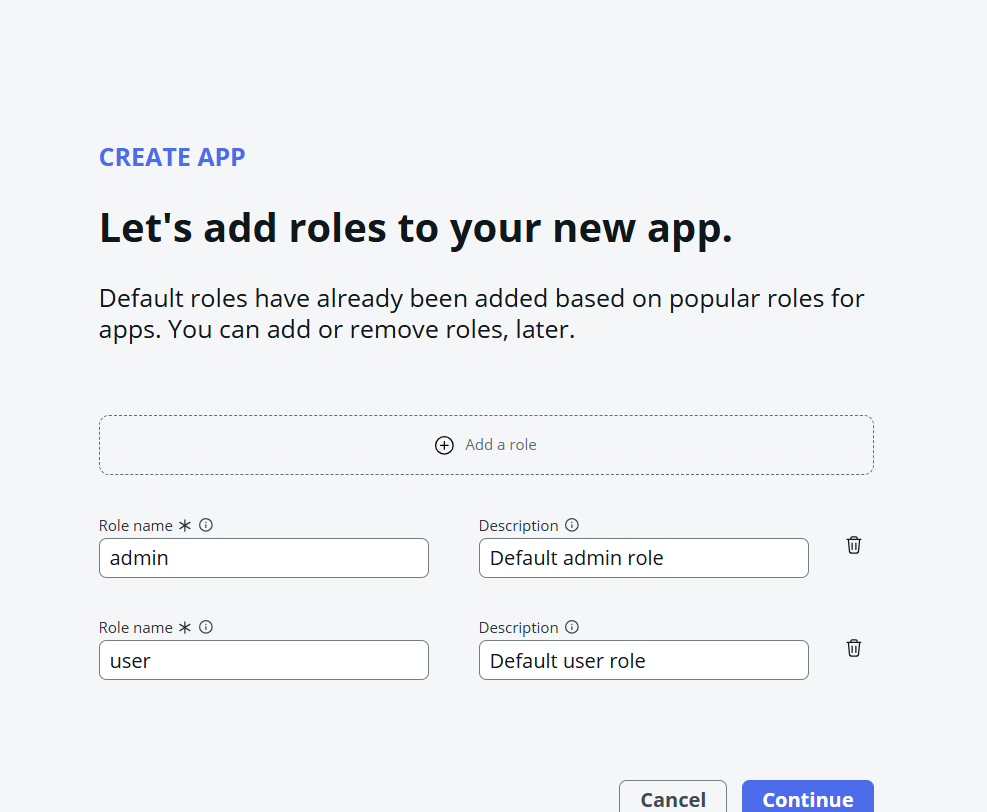
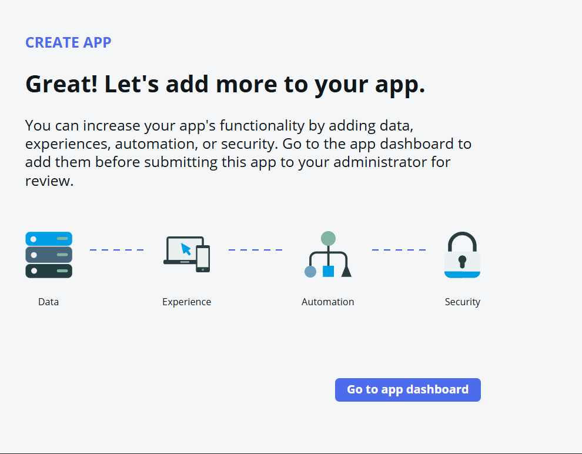

### 2. Building the data model

Created `Project` first, then extended the base `Task` table (rather than building a parallel custom table) to inherit SLA/state-flow/mobile support for free — the only new field needed was a `project` reference. `Team` and `Team Member` followed the same pattern.

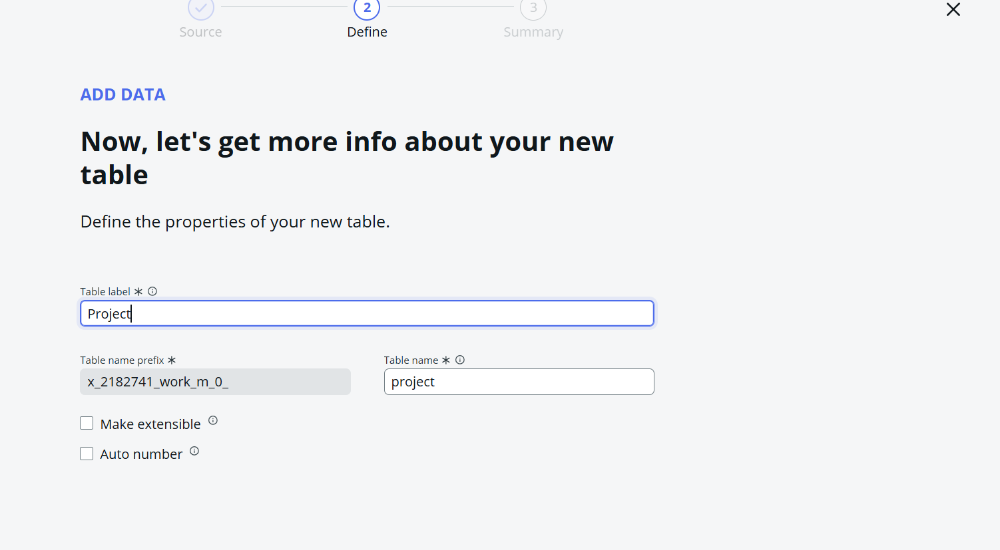
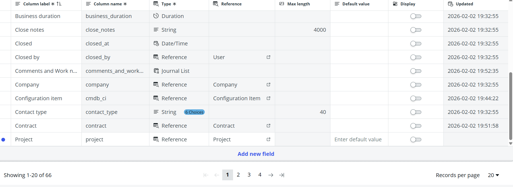
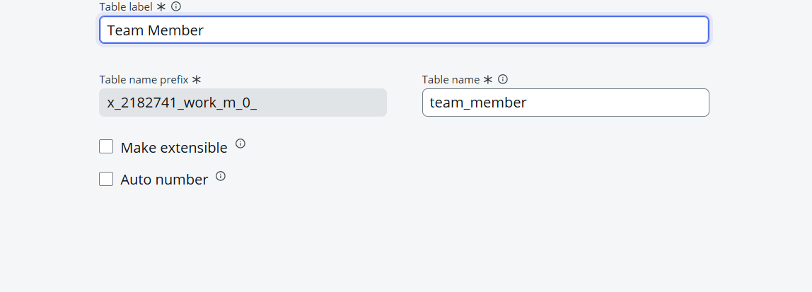

### 3. RBAC — beyond table-level ACLs

Studio's wizard gives you table-level role permissions out of the box. That's not enough for real RBAC, so two scripted ACL conditions were added on top:
- **Task** read/write, role `member` → `answer = (current.assigned_to == gs.getUserID());`
- **Team Member** create/read/write/delete, role `lead` → a small `TeamAccessUtils` Script Include checking the current user is actually the lead of that specific team.

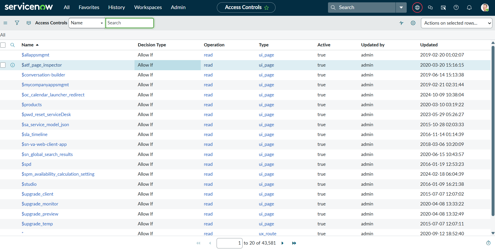
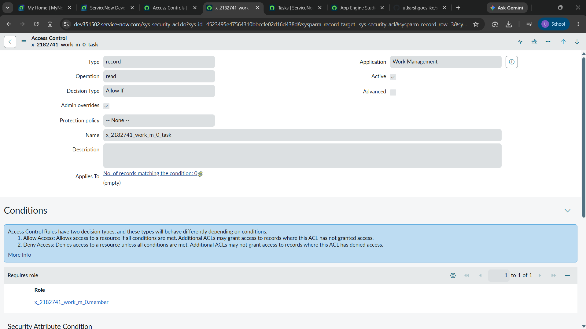

### 4. Flow Designer automation

Three flows, each solving a different trigger shape:
- **Task Assigned Notification** — real-time trigger, fires on `assigned_to` changing.
- **Task Overdue Escalation** — a *scheduled* daily trigger (nothing changes on a record just because time passes), using Look Up Records + For Each to escalate every overdue task to its project owner.
- **Task Completed Notification** — fires on `state` changing to Closed Complete, notifies the project owner.

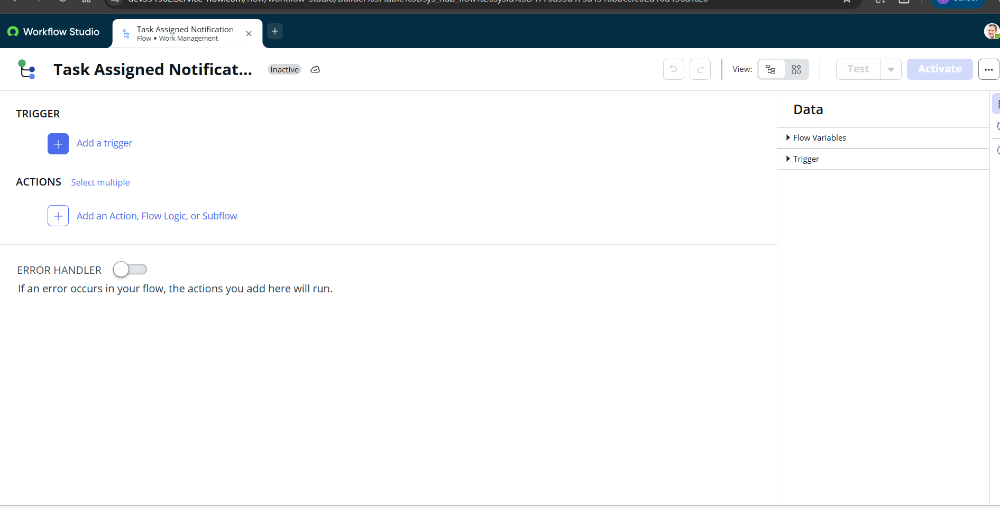
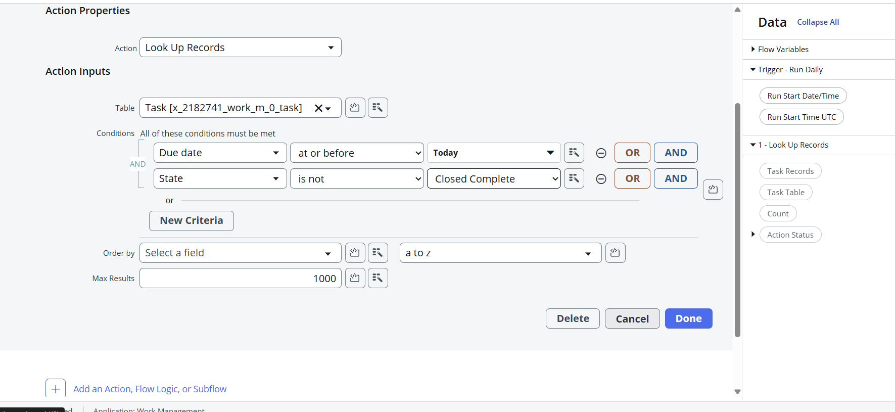
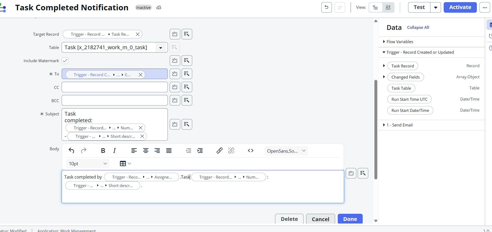

### 5. Dashboard

Three native reports (Tasks by State, Projects by Status, Tasks by Priority) assembled into one dashboard — no Performance Analytics plugin required.

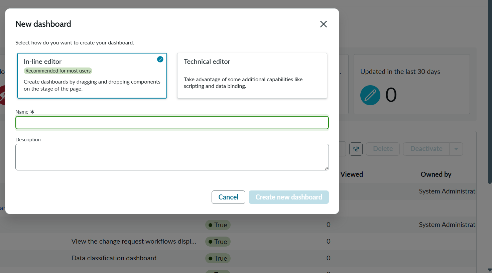

### 6. Proving RBAC works, not just configuring it

A dedicated test user (`test.member`, holding only the `member` role) plus an ATF test: insert a task assigned to someone else, impersonate the member, assert **zero** records match — i.e., the ACL actually hides it. Passed 100%.

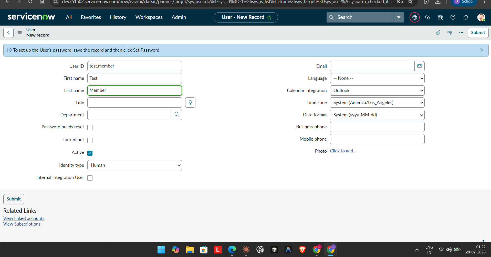
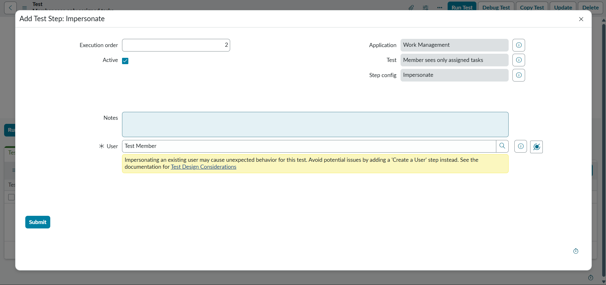

### 7. A real UI: the Workspace experience

Rather than leave this as raw backend tables, built a Now Experience Workspace so PMs/leads/members interact with actual list views, forms, and a home page — not classic ServiceNow chrome.

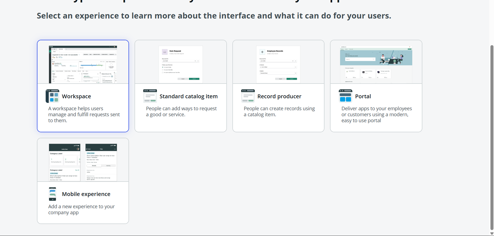
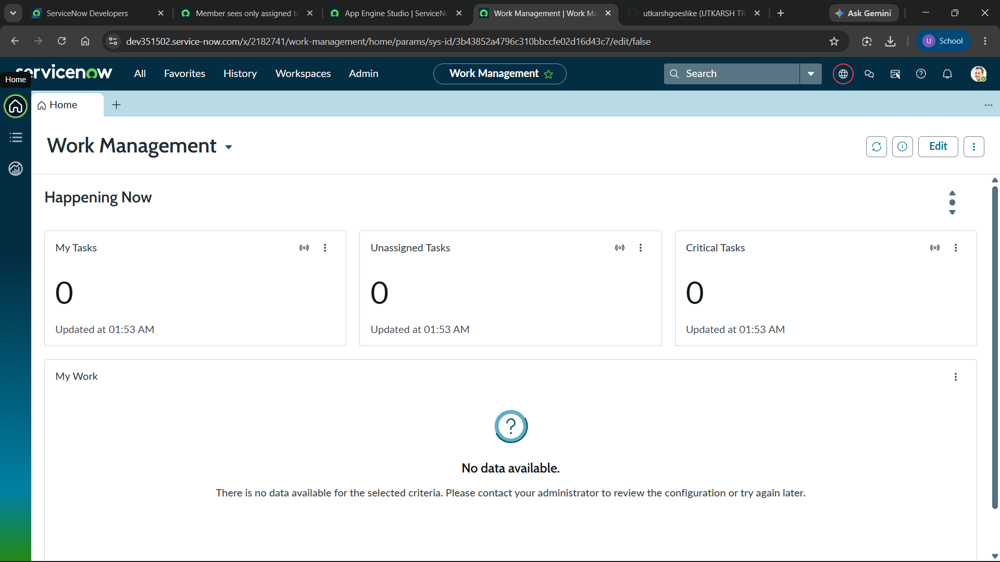

### 8. End-to-end verification with real data

Created a real Project, Task, Team, and Team Member through the Workspace UI itself — and confirmed the **Task Assigned Notification** flow actually generated the correct email in the outbox when a task was assigned, closing the loop from data model → RBAC → automation → UI.

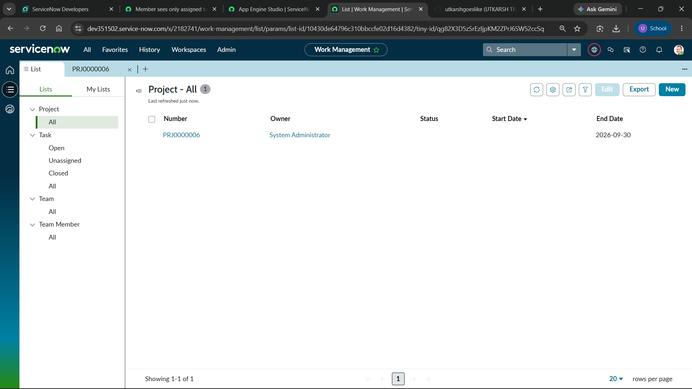
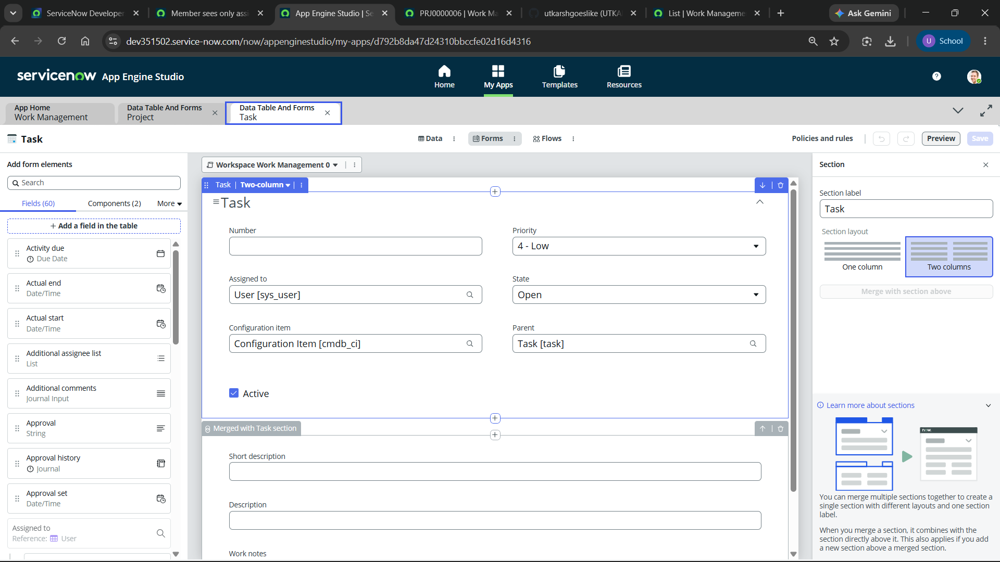
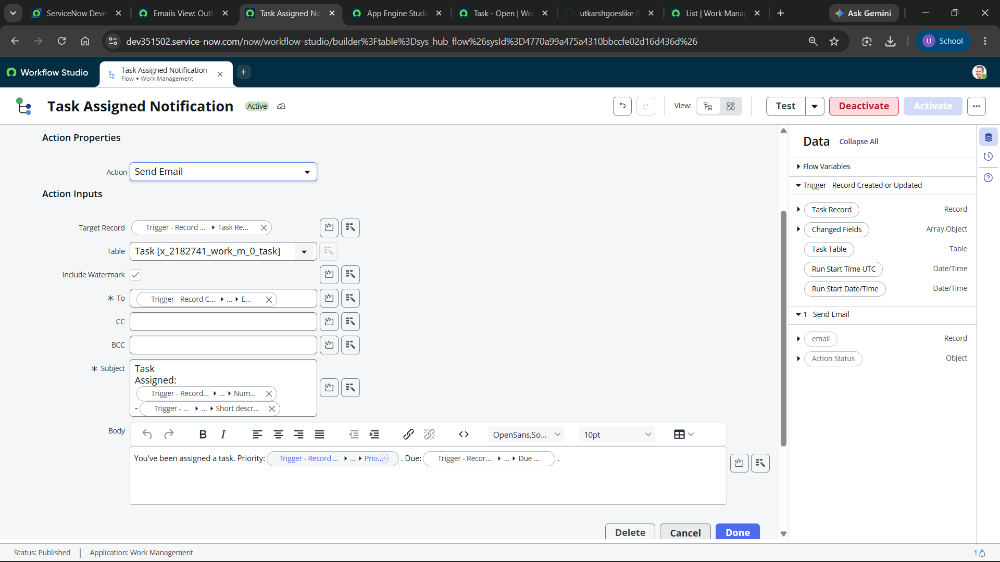
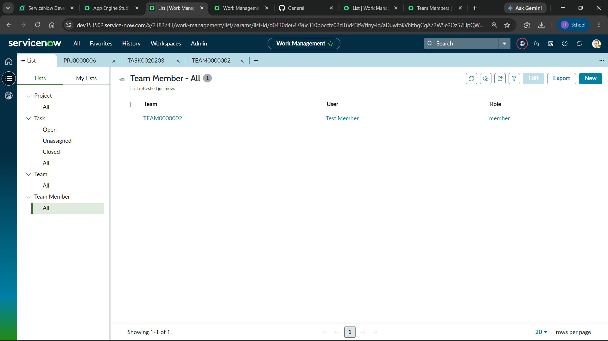

---

## Real problems hit along the way (and how they got fixed)

- **Workspace forms auto-generate with only the `Number` field.** Every table's Studio-generated form/list needed fields manually added via the form/list designers — a gap that isn't obvious until you actually try to create a record.
- **`Assigned to` came back empty for every user.** The base `Task` table ships a `roles=itil` reference qualifier — irrelevant to an app with its own custom role model. Clearing it fixed the picker.
- **A Choice field picker silently failed (`No results found`, uneditable) even though the choices existed** — a transient rendering bug in the newly-built workspace form; routing through the classic UI form (or just retrying) worked around it.
- **GitHub showed an empty repo.** ServiceNow's Source Control Integration pushes to a per-instance branch (`sn_instances/<name>`), not `main` — the actual content was always there, just on a different branch than the one GitHub displays by default.
- **A Flow Designer Subject field silently dropped its literal-text separators on save**, even though it displayed correctly while editing — caught by actually opening the generated email record and reading the raw Subject, not just trusting the builder's preview.

---

## Repo layout

```
<app-scope-folder>/
  update/                  # sys_update_xml records: tables, ACLs, roles, flows...
  dictionary/               # field-level dictionary entries
  author_elective_update/   # choice sets
docs/
  screenshots/              # this case study's images
README.md
```

## Syncing this repo with a PDI

1. In App Engine Studio, open the app → **Source Control → Configure** → point at this repo's URL, authenticate with a GitHub PAT (`repo` scope, `Contents: Read and write`).
2. Push/pull from Studio's Source Control menu as usual; this repo's default branch (`main`) is a periodic fast-forward mirror of whatever `sn_instances/<your-instance>` branch your own PDI pushes to.
